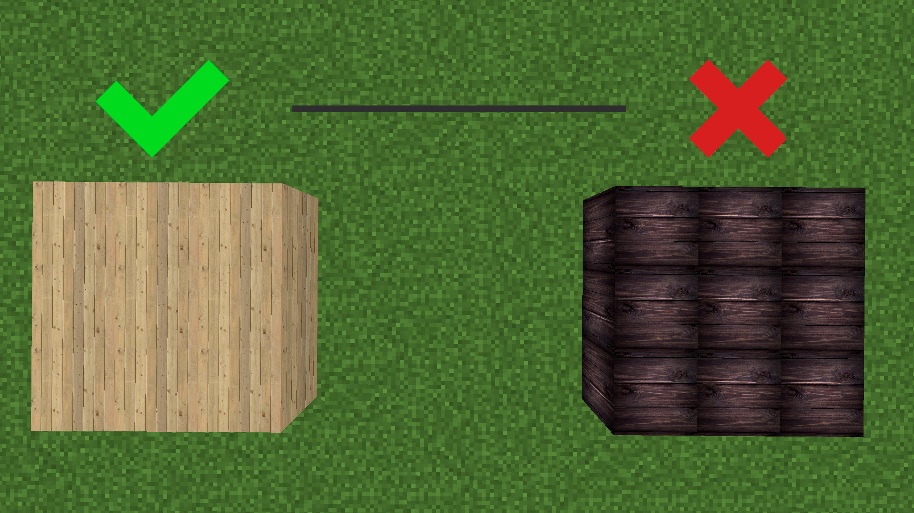

🔗 [All social media](https://github.com/Kisonix-Dev/Texture-blocks/wiki/Social-media)
🔗 [Twitter](https://twitter.com/Kisonix_dev)
🔗 [Reddit](https://www.reddit.com/user/Kisonix)
🔗 [Documentation](https://github.com/Kisonix-Dev/Texture-Blocks/wiki/Home)
🔗 [Planet Minecraft](https://www.planetminecraft.com/mod/texture-blocks/)

# I'm leaving soon from vacation. 

> [!NOTE]
> If you do not speak the Java programming language, then we have given you the opportunity to take part in editing the code of our mod using the software - Mcreator.

> [!WARNING]
> This mod is mainly designed for our project ATLANT RP.
> Therefore, there may be incorrect textures in fashion.

• Hello. I recently developed a mod called Texture blocks.

• Maud presents 2.000+ blocks of different shades of texture.

• This modification will make your buildings more realistic and beautiful.

• Maud is suitable mainly for creative mode, for construction.

• Texture resolution: 256x256.

# Brief Development Stages

- [X] Publication of news about the modification.
- [X] Mod assembly.
- [X] Publishing a mod.
- [ ] Testing. 
- [ ] Bug fixes. 
- [ ] Release. :tada:

# Problem with some textures 

I know about the problem of some textures that do not repeat nicely on blocks. I'll fix all these textures to normal later!
You can see an example in the screenshots below.

# List of blocks

| Name |
| --- |
| Asphalt |
| Concrete |
| Cobblestone |
| Granite |
| Ground |
| Dirt |
| Wood |
| Wooden planks |
| Stones |
| Bricks |
| Carpets |
| Laminate |
| Linoleum |
| Moss |
| Marble tiles |
| Panels |
| Parquet |
| Wallpapers |
| Sandstone |
| Tiles |
| Ceiling |
| Grass |
| Roof tiles |
| Crushed stone |

# Information about the modification 

| Name | Description |
| --- | --- |
| Type: | Mixed blocks |
| Requirements: | No |
| Does gravity work: | No |
| Transparency: | No |
| Luminosity: | No |
| Explosion resistance: | 6 |
| Durability: | 1.5 |
| Dropout: | same block |
| Flammable: | No |
| Lights up from lava: | No |
| Block has craft: | No |
| Generation in the world: | No |

# Destruction 

| Name | Description |
| --- | --- |
| Block: | All texture blocks |
| Tool: | Mixed |
| Wooden: | 1.15 |
| Stone: | 0.6 |
| Iron: | 0.4 |
| Diamond: | 0.3 |
| Netherite: | 0.25 |
| Gold: | 0.2 |

# Identification values ID

| Name | Description |
| --- | --- |
| Name: | Texture blocks |
| Registry name: | texture_blocks |
| Command: | texture_blocks:(Material ID) (Block ID) |
